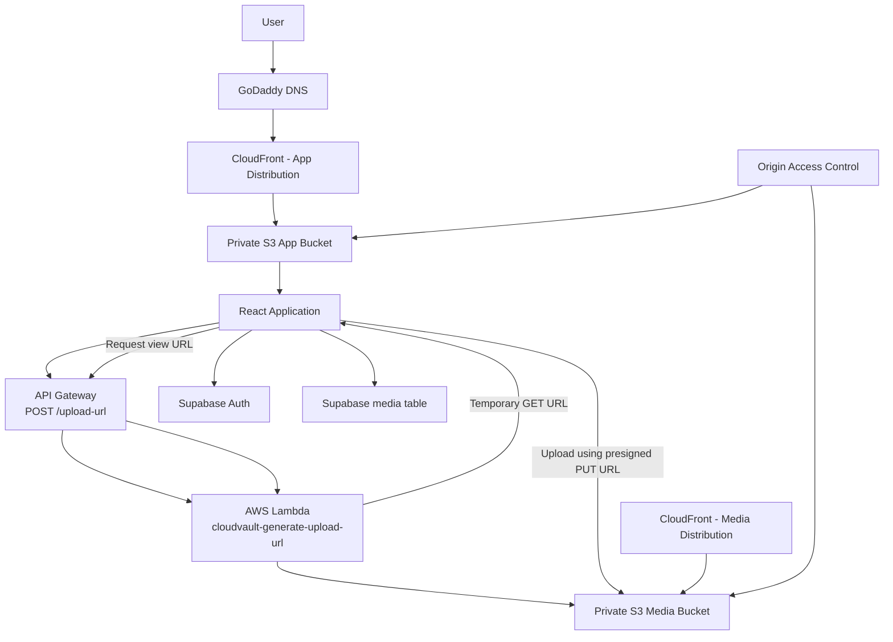

# CloudVault

CloudVault is a cloud-based media gallery for uploading and viewing images and videos using AWS storage and serverless services.

> **Live application:** https://www.sanjana-cloud.in

## Overview

CloudVault lets users upload images and videos to private AWS S3 storage and view them through a web gallery. The React frontend communicates with an API Gateway endpoint to request temporary S3 presigned URLs. The browser then uploads or retrieves media directly from S3 without exposing AWS credentials.

The project documentation describes the AWS architecture, upload flow, viewing flow, CloudFront delivery, private S3 buckets, OAC, custom-domain setup, and HTTPS configuration.

## Features

- User sign-up and login
- Protected gallery experience
- Upload images and videos
- Client-side validation for supported media and the documented 50 MB limit
- Direct browser-to-S3 uploads using temporary presigned URLs
- Temporary URLs for viewing private media
- Private S3 buckets
- CloudFront-based delivery
- Custom domain with GoDaddy DNS
- HTTPS using AWS Certificate Manager (ACM)

## Tech Stack

### Frontend

- React
- TypeScript
- Material UI (MUI)
- React Router

### AWS / Cloud Infrastructure

- Amazon S3
- Amazon CloudFront
- CloudFront Origin Access Control (OAC)
- Amazon API Gateway
- AWS Lambda
- AWS Certificate Manager (ACM)
- IAM
- GoDaddy DNS

### Authentication / Data Layer

The supplied frontend source contains Supabase integration for authentication and media metadata.

- Supabase Auth
- Supabase database table for media records

**Architecture note:** The supplied project documentation also lists a Cognito Identity Pool among the AWS services. The source archive contains `src/services/supabase.ts` and uses Supabase Auth, so the exact current production authentication setup should be verified before making an infrastructure claim.

## Architecture



## Request and Upload Flow

### 1. Website request

When a user visits:

`https://www.sanjana-cloud.in`

GoDaddy DNS directs the request toward the CloudFront distribution. CloudFront serves the React application from the private S3 app bucket.

CloudFront checks its cache:

- **Cache hit:** CloudFront serves the cached object.
- **Cache miss:** CloudFront requests the object from the S3 origin.

Because the S3 bucket is private, CloudFront uses **Origin Access Control (OAC)** to access the bucket securely.

### 2. User clicks Upload

The React application starts the upload process.

The documented flow validates that:

- The file is an image or video.
- The file is no larger than 50 MB.

The frontend then requests a presigned upload URL from:

`POST /upload-url`

### 3. API Gateway

API Gateway receives the request and routes it to the Lambda function responsible for generating the temporary S3 URL.

### 4. Lambda

The Lambda function `cloudvault-generate-upload-url` receives request information such as:

- `fileName`
- `fileType`
- `userId`
- `action`
- `s3Key`

For an upload, Lambda creates an S3 object key using the user ID, filename, and current date.

It then creates an S3 `PutObject` operation containing:

- Bucket
- Key
- Content type

Lambda generates a presigned URL valid for **300 seconds (5 minutes)** and returns the upload URL and S3 key.

### 5. Browser uploads directly to S3

The React application receives the presigned URL and uploads the media directly to the private S3 media bucket.

AWS credentials are not exposed to the browser for this operation.

## Viewing Media

The same API endpoint can handle a view request.

The frontend sends:

- `action: "get"`
- `s3Key`

Lambda creates an S3 `GetObject` operation and generates a temporary URL valid for **3600 seconds (1 hour)**.

The frontend uses that temporary URL to retrieve/view the media.

## CloudFront and Private S3

CloudVault uses separate CloudFront distributions for:

1. The React application/build files.
2. Media delivery.

The S3 buckets remain private. CloudFront uses **Origin Access Control (OAC)** to access the S3 origins without making the buckets publicly accessible.

## Custom Domain and HTTPS

The documented production flow is:

```text
User
  ↓
https://www.sanjana-cloud.in
  ↓
GoDaddy DNS
  ↓
CloudFront
  ↓
Private S3 App Bucket
  ↓
React Application
```

HTTPS is configured using an AWS Certificate Manager (ACM) SSL/TLS certificate.

## Authentication and Media Metadata

The supplied source code includes Supabase integration:

- `src/services/supabase.ts` creates the Supabase client.
- `src/hooks/useAuth.tsx` manages the authenticated user/session.
- Login and signup use Supabase Auth.
- `src/services/mediaService.ts` stores and retrieves media metadata from a `media` table.

The media metadata represented in the frontend includes:

- `user_id`
- `file_name`
- `file_type`
- `file_size`
- `s3_key`
- `created_at`

## Important Security Concepts

### Private S3 buckets

The application uses private buckets rather than allowing direct public access.

### Presigned URLs

Presigned URLs provide temporary, limited access to specific S3 operations without exposing long-lived AWS credentials to the browser.

### Origin Access Control

OAC allows the CloudFront distribution to access a private S3 origin while keeping the bucket private.

### IAM

The Lambda function uses an IAM execution role to obtain the permissions required to interact with S3.

## Key Concepts to Remember

1. **CloudFront** — distributes the frontend globally from the S3 app bucket.
2. **API Gateway** — exposes the API endpoint used by the React application.
3. **Lambda** — generates temporary S3 presigned URLs.
4. **Presigned URL** — lets the browser upload or retrieve an S3 object without exposing AWS credentials.
5. **IAM Role** — gives Lambda the permissions it needs to interact with AWS resources.

## Documentation

The full project explanation is included in:

`docs/CloudVault-project.docx`

It is intentionally kept alongside the README so that the repository contains both:

- a quick project overview in `README.md`
- the detailed project documentation in `docs/CloudVault-project.docx`

